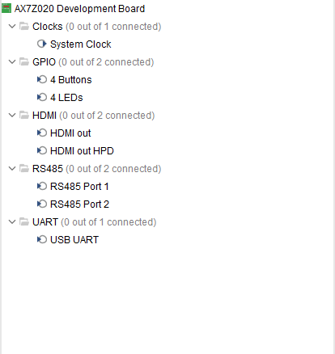

# ALINX AX7Z020 Vivado Board Definition

This board file enables the ALINX AX7Z020 development board with full support for:

- HDMI Output
- RS485 (2 Channels)
- CAN Bus (2 Channels)
- LEDs, Buttons
- Clock Input
- USB-to-UART Debugging

---

## 📷 Board Diagram with Interface Labels



> The annotated image shows interface labels (HDMI, RS485, CAN, etc.) as they are physically positioned on the board.

---

## 🔌 Interface Pin Mapping (Summary)

| Interface      | Signal         | Zynq Pin   | MIO/PL | Description                   |
|----------------|----------------|------------|--------|-------------------------------|
| **HDMI OUT**   | TMDS+/-        | H16..A20   | PL     | HDMI transmitter              |
| **RS485_1**    | TXD / RXD / DE | C8 / C5 / B5 | MIO   | RS485 Transceiver 1           |
| **RS485_2**    | TXD / RXD / DE | W13 / V12 / U19 | PL | RS485 Transceiver 2           |
| **CAN_0**      | TX / RX        | C6 / E9     | MIO    | CAN Transceiver 0 (PS)        |
| **CAN_1**      | TX / RX        | D9 / E8     | MIO    | CAN Transceiver 1 (PS)        |
| **USB UART**   | TX / RX        | B12 / C12   | MIO    | Debug via CP2102              |
| **LEDs**       | [0:3]          | J14..H18    | PL     | 4 LEDs                        |
| **Buttons**    | [0:3]          | M15..L16    | PL     | 4 Push Buttons                |
| **System Clock** | CLK          | U18         | PL     | 50 MHz oscillator             |

---

## 🧩 Usage in Vivado

1. Place the folder under:
```
    C:\Xilinx\Vivado\2023.1\data\boards\board_files\AX7Z020\
```
2. Restart Vivado.

3. Select **AX7Z020 Development Board** when creating a new project.

---

## 📚 Resources

- [AX7Z020 Board Product Page](https://www.en.alinx.com/Product/SoC-development-Boards/Zynq-7000-SoC/AX7Z020B.html)
- [Silicon Labs CP2102 Datasheet](https://www.silabs.com/documents/public/data-sheets/cp2102n-datasheet.pdf)

---

## 📝 License

MIT License  
Copyright (c) 2025  
Hamed Torki